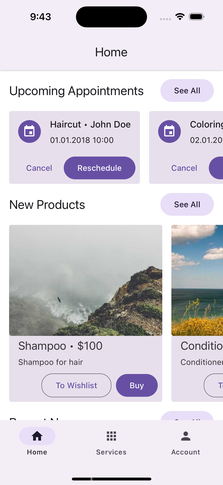
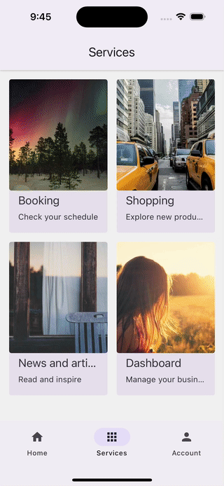
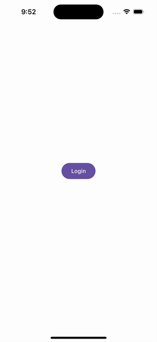

<p align="center">
  
</p>
<p align="center">
  Monorepository template for super app development with React Native and Re.Pack.
</p>

---

[![Build Status][build-badge]][build]
[![Version][version-badge]][package]
[![MIT License][license-badge]][license]
[![PRs Welcome][prs-welcome-badge]][prs-welcome]
[![Chat][chat-badge]][chat]
[![Sponsored by Callstack][callstack-badge]][callstack]

## The problem

Sometimes small app could grow to super app, which means that it provides multiple services like payments, messaging, social network, booking, news, etc. And it's not easy to maintain it. It's hard to keep the codebase clean and to keep the app fast. The app grows in size and not all users want to keep a huge app just for a few sevices. So, we need to split the app into smaller parts and make it possible to install only the services that user needs. But somebody want all the services in one place. So super app still should be available as one app.
There are a few options to solve this problem:

- Split the app into several smaller apps, keep super app as well and move reusabale parts into libraries. But even small changes in a library could lead to a lot of work to update all the apps and redeploy all of them.
- Use a monorepository. It's a good option, but it's not always easy to set up and maintain monorepo. Also it is not so easy to divide work on the project between several team independently or provide a way for external developers to contribute only in one part of the repo or one certian app.

## The solution

This template is a monorepository with a few apps using micro-frondend architecture. It's easy to set up and maintain. These independent apps could be deployed as separate apps or as a part of super app. Developer could move these micro-frontends to separate repositories and deploy them as separate apps. That helps to divide work on the project between several team independently or provide a way for external developers to contribute only in one part of the repo or one certian app. The difference between classic monorepo and this template is runtime dependencies. This means no need to redeploy any of micro-frontends if you change something in the library. It's enough to update micro-frondtend and all the apps will use the latest version of the it.

## The Super App

<table>
  <tr>
    <td>Host App</td>
    <td>Mini Apps Interaction</td>
    <td>Booking Standalone App</td>
  </tr>
  <tr>
    <td></td>
    <td></td>
    <td></td>
  </tr>  
</table>

## Structure


The super app contains 4 apps:

- `host` - the main app, which is a super app. It contains all the micro-frontends and provides a way to navigate between them.
- `shell` - the blueprint of `host` app with shared dependencies. It could be shared across all the teams, since there no necessary secrets available in this version of `host` app.
- `booking` - micro-frontend for booking service.
  Booking exposes `UpcomingAppointments` screen and `MainNavigator`. `MainNavigator` is Booking app itself. `UpcomingAppointments` screen is a screen, which is used in the super app in its own navigation.
- `shopping` - micro-frontend for shopping service.
  Shopping exposes `MainNavigator`. `MainNavigator` is Shopping app itself.
- `news` - micro-frontend for news service.
  News exposes `MainNavigator`. `MainNavigator` is News app itself. News mini app stored in separate repository https://github.com/callstack-internal/news-mini-app-template to provide the example of using remote container outside of the monorepo.
- `dashboard` - micro-frontend for dashboard service.
  Dashboard exposes `MainNavigator`. `MainNavigator` is Dashboard app itself.
- `auth` - module that is used by other modules to provide authentication and authorization flow and UI.

Each of the mini apps could be deployed and run as a standalone app.

## How to use

### Setup

Install dependencies for all apps:

```
yarn bootstrap
```

### Run

Start dev server for host and mini apps:

```
yarn start
```

Or start dev server for a specific app ([host](./packages/host/README.md) | [booking](./packages/booking/README.md) | [shopping](./packages/shopping/README.md) | [news](https://github.com/callstack/news-mini-app-template) | [dashboard](./packages/dashboard/README.md)):

```
yarn start:<app-name>
```

Or start dev server for a specific app as a standalone app. It's useful for testing micro-frontend as a standalone app:

```
yarn start:standalone:<app-name>
```

Running the mini app as a standalone requires running the [catalog-server](./packages/catalog-server/README.md) and [auth module](./packages/auth/README.md):

```
yarn start:catalog
```

```
yarn start:auth
```

Or run commands concurrently:

```
yarn concurrently -P "yarn start:catalog" "yarn start:auth"
```

Run iOS or Android app (ios | android):

```
yarn run:<app-name>:<platform>
```

For Android, make sure to reverse adb ports:

```
yarn adbreverse
```

There is no `start:shell` script to avoid running shell and host app concurrently. It's not possible to run shell and host app concurrently, since they use the same port. If you want to run shell app, you should run `yarn start:standalone:shell` and then run each mini app bundler you want to use in shell app.

### Test

Run tests for all apps:

```
yarn test
```

### Lint

Run linter for all apps:

```
yarn lint
```

### Type check

Run type check for all apps:

```
yarn typecheck
```

## Troubleshooting

TBD

## Documentation

TBD

## Known Issues

The "booking" and "shopping" mini-apps can't be run in standalone mode (i.e. without the host running). This is a deliberate decision of this repository to showcase the possibility and to reduce the amount of work to keep the mini-apps dependencies up-to-date.
The "dashboard" mini-app can be run as a standalone app (without the host). It's up to you to decide on what kind of developer experience your super app has.

Repack v3 HMR breaks React Native inspector/devtools in RN 0.70 version. A bypass added three patches for the dashboard, shell, and host. [link](https://github.com/callstack/repack/issues/251).

## Contributing

Read the [contribution guidelines](/CONTRIBUTING.md) before contributing.

## Made with ❤️ at Callstack

Super App Template is an open source project and will always remain free to use. If you think it's cool, please star it 🌟. [Callstack][callstack-readme-with-love] is a group of React and React Native geeks, contact us at [hello@callstack.com](mailto:hello@callstack.com) if you need any help with these or just want to say hi!

<!-- badges -->

[build-badge]: https://img.shields.io/circleci/project/github/callstack/super-app-template/master.svg?style=flat-square
[build]: https://circleci.com/gh/callstack/super-app-template
[version-badge]: https://img.shields.io/npm/v/super-app-template.svg?style=flat-square
[package]: https://www.npmjs.com/package/super-app-template
[license-badge]: https://img.shields.io/npm/l/super-app-template.svg?style=flat-square
[license]: https://opensource.org/licenses/MIT
[prs-welcome-badge]: https://img.shields.io/badge/PRs-welcome-brightgreen.svg?style=flat-square
[prs-welcome]: http://makeapullrequest.com
[chat-badge]: https://img.shields.io/discord/426714625279524876.svg?style=flat-square&colorB=758ED3
[chat]: https://discord.gg/zwR2Cdh
[callstack-badge]: https://callstack.com/images/callstack-badge.svg
[callstack]: https://callstack.com/open-source/?utm_source=github.com&utm_medium=referral&utm_campaign=super-app-template&utm_term=readme-badge
[callstack-readme-with-love]: https://callstack.com/?utm_source=github.com&utm_medium=referral&utm_campaign=super-app-template&utm_term=readme-with-love
