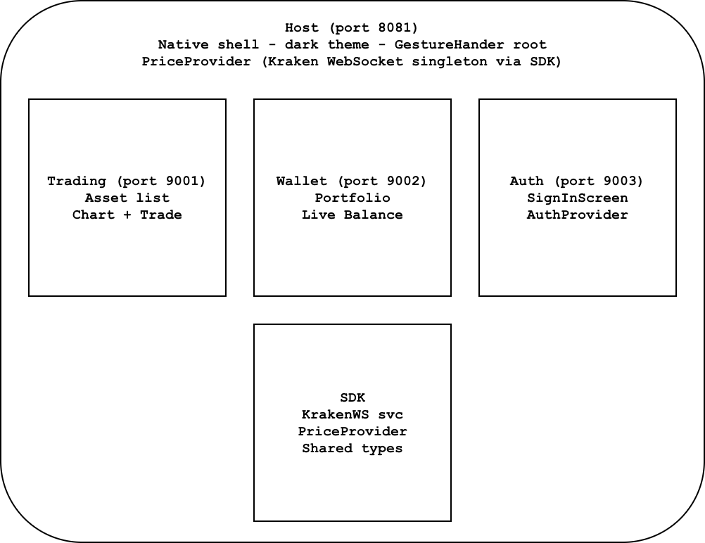

# Micro-Frontends for React Native: A Fintech Case Study

> How Re.Pack and Module Federation bring web-style micro-frontend architecture to mobile — and why fintech teams should care.

---

## The Problem

Fintech products grow fast. A trading app becomes a trading app with a wallet. The wallet adds a crypto exchange. The exchange needs KYC. Before long, a single codebase is owned by four teams who have never met, a change to the auth module blocks the trading release, and every user downloads the full app regardless of which services they actually use.

Web teams solved this years ago with micro-frontends: independently deployable UI slices, each owned by one team, composed at runtime. Mobile hasn't had an equivalent — until now.

---

## The Solution: Module Federation for React Native

[Re.Pack](https://re-pack.dev) is a Webpack/Rspack-based bundler for React Native. Its Module Federation V2 plugin lets you do something React Native was never designed to support: **load a JavaScript bundle from a remote URL at runtime, after the app has shipped**.

Each mini app is:

- A separate bundle, hosted on your CDN
- Independently deployable — no App Store release required
- Developed and tested by its own team in isolation
- Downloaded only when (and if) the user navigates to it

This showcase makes that concrete with a production-grade Fintech app: a trading screen with live crypto prices, a wallet showing real-time portfolio value, and a shared auth layer — all running as independent bundles inside a single native shell.

---

## Architecture



### Packages

| Package            | Role                                                                                    |
| ------------------ | --------------------------------------------------------------------------------------- |
| `packages/host`    | Native shell — owns the binary, all native deps, top-level navigation, MF remote wiring |
| `packages/trading` | Trading mini app — live asset list, Skia chart, trade bottom sheet                      |
| `packages/wallet`  | Wallet mini app — real-time portfolio balance and holdings                              |
| `packages/auth`    | Auth mini app — `AuthProvider`, `SignInScreen`, `AccountScreen`                         |
| `packages/sdk`     | Shared library — `KrakenWebSocketService`, `PriceProvider`, hooks, types, utilities     |

### Key design decisions

**All native dependencies live in `host`.** Mini apps declare them as `peerDependencies` and consume them as Module Federation shared singletons — no duplicate native modules, no double-initialisation crashes, no native code in mini app bundles.

**`sdk` is a shared singleton.** Its `PriceContext` and `KrakenWebSocketService` instance are the same object in memory across host and all mini apps. Trading and Wallet share one WebSocket connection, not two.

**Independent deployability is real.** Each mini app has its own rspack config, dev server, and bundle output. Updating the trading screen is a CDN deploy — no App Store review, no host release.

---

## How Module Federation Is Configured

### Host: consuming remotes

```ts
// packages/host/rspack.config.ts
new Repack.plugins.ModuleFederationPluginV2({
  name: 'host',
  remotes: {
    auth:    `auth@https://cdn.example.com/${platform}/mf-manifest.json`,
    trading: `trading@https://cdn.example.com/${platform}/mf-manifest.json`,
    wallet:  `wallet@https://cdn.example.com/${platform}/mf-manifest.json`,
  },
  shared: getSharedDependencies({eager: true}),
}),
```

The host loads remotes eagerly (`eager: true`) and is the only package that actually runs natively. It provides all shared singletons to the mini apps.

### Mini app: exposing a surface

```ts
// packages/trading/rspack.config.ts
new Repack.plugins.ModuleFederationPluginV2({
  name: 'trading',
  exposes: {
    './App': './src/navigation/MainNavigator',
  },
  shared: getSharedDependencies({eager: false}),
}),
```

Each mini app exposes a single entry point — its navigator. It consumes shared deps lazily (`eager: false`), deferring to whatever version the host has already loaded.

### Loading a mini app in the host

```tsx
// packages/host/src/navigation/TabsNavigator.tsx
const TradingApp = React.lazy(() =>
  randomDelay().then(() => import('trading/App')),
);

<React.Suspense fallback={<Placeholder label="Trading" />}>
  <TradingApp />
</React.Suspense>;
```

`React.lazy` + `Suspense` gives you code splitting and loading states for free. The `randomDelay()` in this showcase makes the loading state visible during demos — in production you'd remove it.

---

## Performance Patterns

The showcase is also a reference implementation of several React Native performance patterns that matter especially in high-frequency UIs like trading dashboards.

### 1. Leaf-component isolation for live data

Subscribing to a live price feed at the row level re-renders the entire row — icon, name, symbol, and price — on every tick. Instead, subscribe in a tiny leaf component that renders only the price text:

```tsx
// PriceCell only re-renders when its price changes
const PriceCell = React.memo(({symbol, flashProgress, flashIsUp}: Props) => {
  const price = useAssetPrice(symbol);
  // updates shared values → triggers UI-thread animation on outer Animated.View
  // does NOT re-render the row
  return <Text>{formatPrice(price)}</Text>;
});

// AssetRow never re-renders on price ticks
const AssetRow = React.memo(({asset, onPress}: AssetRowProps) => {
  const flashProgress = useSharedValue(0);
  const flashIsUp = useSharedValue(true);
  const rowStyle = useAnimatedStyle(() => ({ ... }));

  return (
    <Animated.View style={[styles.row, rowStyle]}>
      <Image ... />
      <View><Text>{asset.name}</Text></View>
      <PriceCell symbol={asset.symbol} flashProgress={flashProgress} flashIsUp={flashIsUp} />
    </Animated.View>
  );
});
```

The flash animation (green/red row highlight on price change) runs on the UI thread via Reanimated shared values — it doesn't cause any React re-renders.

### 2. useTransition for non-priority state

Price ticks should never compete with user interactions like scrolling or opening a bottom sheet:

```tsx
// sdk/src/hooks/usePrices.ts
const [prices, setPrices] = React.useState<PriceMap>({});
const [, startTransition] = React.useTransition();

service.subscribe(symbol, price => {
  startTransition(() => setPrices(prev => ({...prev, [symbol]: price})));
});
```

React treats state updates inside `startTransition` as interruptible — if a user taps or scrolls, React finishes the interaction first and applies the price update after.

### 3. startTransition for chart rebuilds

The same principle applies to the 60-tick chart buffer. Rebuilding chart data synchronously on every tick blocks the JS thread:

```tsx
React.useEffect(() => {
  bufferRef.current = [...bufferRef.current, price].slice(-MAX_TICKS);
  React.startTransition(() => {
    setChartData(bufferRef.current.map((p, i) => ({index: i, price: p})));
  });
}, [price]);
```

### 4. Historical data seeding

The chart is pre-populated with the last 60 1-minute OHLC candles from the Kraken REST API, so it shows meaningful data immediately rather than waiting for 60 live ticks to accumulate:

```tsx
const historicalPrices = useHistoricalPrices(asset.krakenPair);

React.useEffect(() => {
  if (historicalPrices.length === 0 || seededRef.current) return;
  seededRef.current = true;
  bufferRef.current = historicalPrices;
  setChartData(historicalPrices.map((p, i) => ({index: i, price: p})));
}, [historicalPrices]);
```

### 5. React Compiler

`babel-plugin-react-compiler` is configured across all packages. It automatically inserts memoization for components and hooks that would otherwise re-render unnecessarily — no manual `useMemo`/`useCallback` required for the common cases.

---

## The Live Price Feed: One Connection, Many Consumers

This is one of the most important demos in the app. Open the Trading tab and the Wallet tab on the same device. Both show live prices — but there is only one WebSocket connection to Kraken, shared via the Module Federation singleton:

```ts
// KrakenWebSocketService is a singleton
class KrakenWebSocketService {
  private static _instance: KrakenWebSocketService;

  static get shared(): KrakenWebSocketService {
    if (!KrakenWebSocketService._instance) {
      KrakenWebSocketService._instance = new KrakenWebSocketService();
    }
    return KrakenWebSocketService._instance;
  }
}
```

Because `sdk` is declared as a shared singleton in the MF config, `KrakenWebSocketService._instance` is the same object in the host process regardless of which mini app accesses it. Trading subscribes to BTC and ETH. Wallet also subscribes to BTC and ETH. They share the same listeners on the same connection.

In a production app this matters for: battery life, data usage, connection limits, and consistent prices across screens.

---

## Running the Demo

### Setup

```bash
npm install -g pnpm@11.20.0
pnpm install
pnpm pods          # iOS only
```

### Start everything

```bash
pnpm start         # starts host + all mini apps via mprocs
pnpm run:host:ios  # or run:host:android
```

### Demo script

**Step 1 — Authentication gate**

> "The host shell owns authentication. The sign-in screen is a federated module from the `auth` package — the host doesn't ship auth UI code, it loads it at runtime."

Sign in as Demo User. The tab bar appears.

**Step 2 — Live trading list**

> "Every price on this list is a real WebSocket tick from Kraken. Watch the green and red flashes — that's Reanimated running on the UI thread, not the JS thread. The list itself is LegendList, a high-performance alternative to FlatList."

Scroll the list while prices are updating. No jank.

**Step 3 — Asset details and chart**

> "The chart is pre-populated with 60 minutes of real OHLC history. As new ticks arrive, the chart extends — but we wrap those updates in `startTransition`, so opening the trade sheet is always instant."

Tap an asset. Open the trade sheet while prices are updating.

**Step 4 — Trade flow**

> "The trade sheet is `@gorhom/bottom-sheet`. Entering an amount uses an uncontrolled input — no re-render per keystroke. Confirm navigates to a modal success screen."

Complete a trade.

**Step 5 — Wallet with shared price feed**

> "Switch to Wallet. The portfolio balance is updating in real time — same prices as Trading, because both mini apps share the same singleton WebSocket connection via Module Federation. No second connection, no duplication."

Switch to Wallet. Watch the total balance update.

**Step 6 — Independent deployment (the key point)**

> "Now here's the business case argument: if I push a fix to the Trading mini app, I deploy a new bundle to the CDN. The host app on your device gets the update on the next launch — no App Store submission, no waiting for review, no forcing users to update."

---

## Building the Business Case

### Deployment independence

| Scenario                       | Without MF                                | With MF                                  |
| ------------------------------ | ----------------------------------------- | ---------------------------------------- |
| Trading bug fix ships to users | Next App Store release (~1–7 days review) | CDN deploy, available on next app launch |
| Wallet team adds a new feature | Full app release, all teams coordinate    | Wallet deploys independently             |
| Rollback a bad trading release | Re-submit previous version to store       | Swap CDN manifest to previous bundle     |

### Bundle sizes

_Run `pnpm build` for each package and fill in actuals:_

| Bundle                          | Size (gzip)                |
| ------------------------------- | -------------------------- |
| host (shell only, no mini apps) | _TBD_                      |
| trading                         | _TBD_                      |
| wallet                          | _TBD_                      |
| auth                            | _TBD_                      |
| **Total download for new user** | _TBD_                      |
| **If user never opens Wallet**  | host + trading + auth only |

A user who only uses the trading feature never downloads the wallet bundle. At scale, across millions of installs, this is meaningful bandwidth and storage savings.

### CI build times

_Run per-package builds in CI and fill in actuals:_

| Build scope                                  | Time  |
| -------------------------------------------- | ----- |
| Full monorepo build                          | _TBD_ |
| Trading only (`pnpm --filter trading build`) | _TBD_ |
| Wallet only (`pnpm --filter wallet build`)   | _TBD_ |
| Auth only (`pnpm --filter auth build`)       | _TBD_ |

Teams building their mini app independently skip the host build entirely. If the full build takes N minutes, a team working only on Trading runs only the Trading build.

### Team independence

Each mini app has its own:

- Dev server (separate port, separate terminal)
- Bundle pipeline
- Release cadence
- Mock implementations for other remotes (in `mocks/` folder)

The Trading team can develop, test, and deploy the trading feature without ever touching the host or wallet repos.

---

## Objections and Answers

**"We already use code splitting in Metro."**
Metro's code splitting is static — you split at build time and can't update the split points without a new release. Module Federation splits at runtime and makes each split independently deployable.

**"What about native modules? Can mini apps add them?"**
No — and that's by design. All native code lives in the host binary. Mini apps are JS-only bundles. This is the correct constraint: native code requires a store release anyway, so centralising it in the host is the right model.

**"What about security? We can't load arbitrary JS."**
Re.Pack's `CodeSigningPlugin` lets you sign bundles and verify signatures at load time — only bundles signed with your key will execute. The `auth` remote in this showcase is signed; the same can be applied to all remotes.

**"Doesn't this add operational complexity?"**
Yes, there is a CDN to manage and bundle versioning to think about. The trade-off is: operational complexity in your deploy pipeline, in exchange for deployment independence and smaller user-facing bundles. For teams at scale, this is the right trade.

---

## Stack Reference

|                   |                                                                  |
| ----------------- | ---------------------------------------------------------------- |
| React Native      | 0.86.2                                                           |
| React             | 19.2.8                                                           |
| Re.Pack           | 5.2.5 (Rspack-based)                                             |
| Module Federation | V2 (2.8.1)                                                       |
| Animations        | react-native-reanimated 4.5.3 + react-native-worklets 0.11.3     |
| Charts            | victory-native 41.26.0 (Skia-based)                              |
| Lists             | @legendapp/list 3.3.3                                            |
| Bottom sheet      | @gorhom/bottom-sheet 5.2.14                                      |
| Navigation        | @react-navigation/native 7.3.14 + react-native-bottom-tabs 1.4.0 |
| React Compiler    | babel-plugin-react-compiler 1.x                                  |
